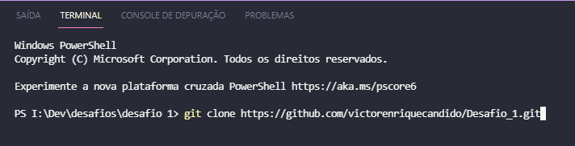
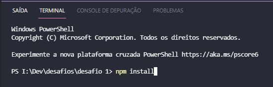
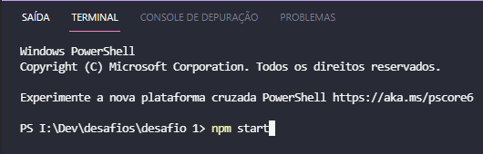
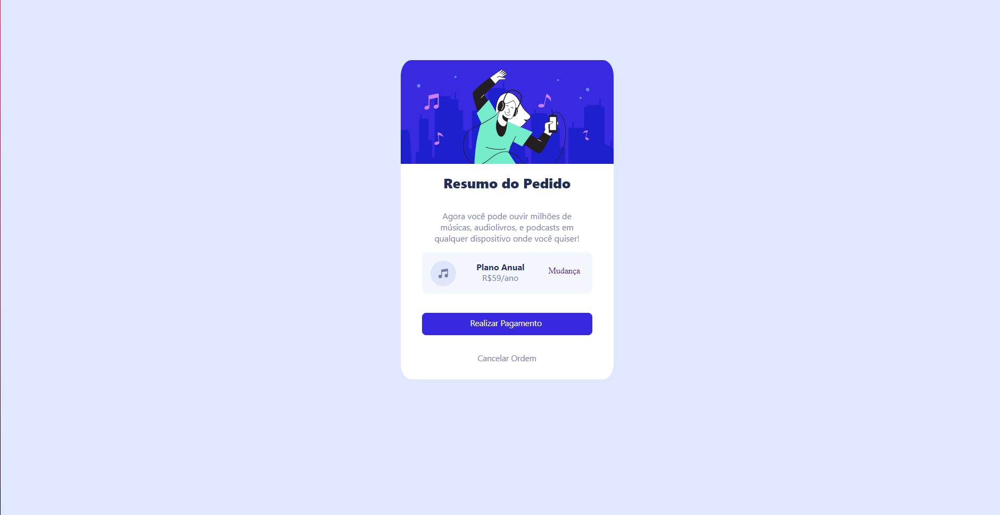

# Primeiro Desafio
<p>Este desafio tem como objetivo verificar a auto-organização e dedicação do futuro
membro do time do Grupo ICTS.</p>

## Descrição
<p>Este desafio consiste na implementação de um card (front-end) que apresenta um
pedido para plano anual de assinatura de música.</p>

## Especificações
- As linguagens utilizadas para o desenvolvimento deste desafio são <b>HTML</b> e
<b>CSS</b>.
- Quaisquer decisões referentes a plugins, arquitetura, padrões
de codificação, controle de versão ou design de interface podem
ser decididos pelo desafiado.
- Deverá ser entregue
  - Página deverá ser desenvolvida como o exemplo a seguir:
<h1 align="center">
  
</h1>

- Cores utilizadas:<br>
  - azul-claro: hsl(225, 100%, 94%);<br>
  - azul: hsl(245, 75%, 52%);<br>
  - azul-bem-claro: hsl(225, 100%, 98%);<br>
  - azul-desbotado: hsl(224, 23%, 55%);<br>
  - azul-escuro: hsl(223, 47%, 23%);<br>

## Arquiterura

```
 📦src
 ┣ 📂assets
 ┃ ┗ 📂img --> Onde encontram-se as imagens aplicadas no projeto.
 ┃ ┃ ┣ 📜background.svg
 ┃ ┃ ┣ 📜icon-music.svg
 ┃ ┃ ┣ 📜ilustracao.svg
 ┃ ┃ ┗ 📜tela.png
 ┣ 📂pages
 ┃ ┣ 📜pedido.js --> Página principal do projeto onde encontra-se nossa tela.
 ┃ ┗ 📜styles.js --> CSS principal do projeto utilizando o Styled Component(js).
 ┣ 📂routers --> Onde encontra-se a rota raiz do projeto(react-router-dom).
 ┃ ┗ 📜index.js
 ┣ 📜App.js
 ┣ 📜global.css --> CSS global do projeto.
 ┣ 📜index.js
 ┗ 📜reportWebVitals.js
 ```
 ## Ferramentas Utilizadas

 - React.
 - Visual Studio code.
 - Extensão Prettier.

 ##  Manual

1. Faça um clone do repositório no terminal.
   ```
   git clone https://github.com/victorenriquecandido/Desafio_1.git
   ```
    <h1 align="left">
      
    </h1>
2. Em seguida você precisa utilizar o comando 'npm install' dentro do projeto.
   ```
   npm install
   ```
    <h1 align="left">
      
    </h1>
3. Após a conclusão da instalação digite o comando 'npm start'.
   ```
   npm start
   ```
    <h1 align="left">
      
    </h1>
4. E com isso você verá a página solicitada no desafio.
    <h1 align="left">
      
    </h1>